# Systematic Portfolio Construction & Risk Allocation Engine

A diversified asset-allocation research framework for comparing how portfolio construction methods manage return, volatility, concentration, risk contribution, turnover, transaction costs, and drawdowns across asset classes.

The project asks:

> How do different portfolio allocation methods manage risk, return, diversification, concentration, and drawdowns across asset classes?

This is not a factor-alpha backtester. The focus is portfolio construction and risk allocation across a small ETF universe.

## Why Portfolio Construction Matters

Asset allocation decisions often explain more of a diversified portfolio's behavior than individual security selection. A method that looks attractive on return alone may concentrate risk in one asset class, trade too aggressively, or fail during stress periods. This project compares allocation rules with the same data, rebalance schedule, constraints, cost model, and performance reporting so the trade-offs are visible.

## Allocation Methods

- Equal weight
- Inverse volatility
- Minimum variance
- Maximum Sharpe
- Risk parity / equal risk contribution
- Covariance-shrunk minimum variance, maximum Sharpe, and risk parity
- 10% portfolio-level volatility targeting variants
- Trend-filtered equal weight, minimum variance, and risk parity
- Dual momentum equal weight and inverse-volatility variants

Base methods are long-only, weights sum to 1, and no leverage is used. Optimized methods use 0% to 40% asset bounds. Volatility-targeted variants can scale exposure up to 1.5x when trailing realised volatility is below the target.

## ETF Universe

| Ticker | Asset class |
|---|---|
| SPY | US equities |
| EFA | Developed ex-US equities |
| EEM | Emerging markets equities |
| TLT | Long-term US Treasuries |
| IEF | Intermediate US Treasuries |
| SHY | Short-duration US Treasuries / cash proxy |
| GLD | Gold |
| VNQ | REITs |
| DBC | Commodities |

The default sample uses adjusted close prices from yfinance from 2010-01-01 through 2024-12-31.

## Methodology

- 252 trading day estimation window
- Monthly rebalancing on the last available trading day of each month
- Weights estimated only from trailing historical returns
- Weights applied starting the next trading session after calculation
- Default transaction cost of 5 bps per one-way trade
- Volatility targeting uses a lagged 63-day realised volatility estimate
- Trend and dual momentum signals are lagged by one trading day
- Daily strategy returns and daily applied weights are saved

Look-ahead bias control is explicit in `src/backtest.py`: for a rebalance date at position `i`, weights are estimated from `returns.iloc[i - 252:i]`, which excludes the rebalance date return and future returns. The decision weights are then shifted by one trading day before returns are calculated. Volatility target scaling is also shifted by one day, and trend/momentum signals use lagged prices.

## Run

```bash
pip install -r requirements.txt
python main.py
```

Running the project writes CSV outputs and charts to `outputs/`. CSV files are ignored by git; PNG charts are tracked so they render in this README.

## Outputs

CSV files:

- `outputs/performance_summary.csv`
- `outputs/subperiod_results.csv`
- `outputs/cost_sensitivity.csv`
- `outputs/vol_target_results.csv`
- `outputs/shrinkage_sensitivity.csv`
- `outputs/benchmark_relative_metrics.csv`
- `outputs/stress_results.csv`
- `outputs/risk_contribution.csv`
- `outputs/average_weights.csv`
- `outputs/daily_returns.csv`
- `outputs/portfolio_weights.csv`

Charts:

- `outputs/equity_curves.png`
- `outputs/drawdowns.png`
- `outputs/rolling_sharpe.png`
- `outputs/average_weights.png`
- `outputs/risk_contribution.png`
- `outputs/cost_sensitivity.png`
- `outputs/performance_comparison.png`
- `outputs/equity_curves_extended.png`
- `outputs/drawdowns_extended.png`
- `outputs/vol_target_comparison.png`
- `outputs/trend_filter_comparison.png`
- `outputs/dual_momentum_comparison.png`
- `outputs/stress_period_comparison.png`

## Results

<!-- RESULTS_START -->
The tables below are regenerated by `python main.py` from the CSV files in `outputs/`.

## Key Results

- Best Sharpe: Minimum Variance (0.78).
- Best CAGR: Dual Momentum Equal Weight (8.31%).
- Lowest max drawdown: Minimum Variance (-12.91%).
- Best 2022 inflation/rate-shock result: Maximum Sharpe Vol Target 10% (-3.59%).
- Transaction costs: moving from 0 bps to 20 bps reduced the most affected strategy CAGR by 1.39%.

### Top Strategies by Sharpe

| strategy                        | cagr  | sharpe_ratio | max_drawdown | annualized_volatility | average_turnover |
| ------------------------------- | ----- | ------------ | ------------ | --------------------- | ---------------- |
| Minimum Variance                | 2.84% | 0.78         | -12.91%      | 3.68%                 | 3.64%            |
| Maximum Sharpe Vol Target 10%   | 6.30% | 0.77         | -18.93%      | 8.43%                 | 49.75%           |
| Dual Momentum Equal Weight      | 8.31% | 0.75         | -18.17%      | 11.48%                | 33.52%           |
| Minimum Variance Shrinkage      | 2.75% | 0.75         | -12.99%      | 3.70%                 | 3.58%            |
| Trend Filtered Minimum Variance | 2.94% | 0.75         | -14.48%      | 3.98%                 | 9.63%            |
| Minimum Variance Vol Target 10% | 3.97% | 0.74         | -18.54%      | 5.47%                 | 6.79%            |
| Dual Momentum Inverse Vol       | 7.93% | 0.73         | -17.50%      | 11.28%                | 36.98%           |
| Maximum Sharpe                  | 4.48% | 0.66         | -15.89%      | 6.99%                 | 32.09%           |
| Trend Filtered Risk Parity      | 3.00% | 0.65         | -15.55%      | 4.76%                 | 13.21%           |
| Maximum Sharpe Shrinkage        | 4.42% | 0.64         | -15.80%      | 7.11%                 | 26.70%           |
| Risk Parity                     | 2.99% | 0.64         | -14.29%      | 4.76%                 | 2.48%            |
| Inverse Volatility              | 3.23% | 0.64         | -14.56%      | 5.15%                 | 1.95%            |

### Interpretation

- Volatility targeting is applied with lagged 63-day realised volatility and a 1.5x leverage cap. In this run, 10% vol-target variants should be judged against their unscaled base strategies rather than as standalone alpha models.
- Equal Weight Vol Target 10%: Sharpe delta -0.13; max drawdown worsened by 0.90% versus the unscaled base strategy.
- Minimum Variance Vol Target 10%: Sharpe delta -0.04; max drawdown worsened by 5.63% versus the unscaled base strategy.
- Risk Parity Vol Target 10%: Sharpe delta -0.08; max drawdown worsened by 5.52% versus the unscaled base strategy.
- Maximum Sharpe Vol Target 10%: Sharpe delta 0.10; max drawdown worsened by 3.05% versus the unscaled base strategy.
- Trend filtering uses lagged price signals. It can reduce exposure in prolonged downtrends, but it can also lag reversals and miss recoveries.
- Trend Filtered Equal Weight worsened max drawdown versus Equal Weight by 1.80%.
- Trend Filtered Minimum Variance worsened max drawdown versus Minimum Variance by 1.56%.
- Trend Filtered Risk Parity worsened max drawdown versus Risk Parity by 1.26%.
- Dual momentum is tactical and regime-sensitive. Its results are included as a comparison, not as proof that momentum will persist.
- Dual Momentum Equal Weight Sharpe was 0.75, 0.18 versus Equal Weight.
- Dual Momentum Inverse Vol Sharpe was 0.73, 0.16 versus Equal Weight.

### Performance Summary

| strategy                        | total_return | cagr  | annualized_volatility | sharpe_ratio | max_drawdown | average_turnover | effective_number_of_assets |
| ------------------------------- | ------------ | ----- | --------------------- | ------------ | ------------ | ---------------- | -------------------------- |
| Equal Weight                    | 93.43%       | 4.86% | 8.96%                 | 0.57         | -18.21%      | 0.56%            | 9.00                       |
| Inverse Volatility              | 55.50%       | 3.23% | 5.15%                 | 0.64         | -14.56%      | 1.95%            | 4.65                       |
| Minimum Variance                | 47.58%       | 2.84% | 3.68%                 | 0.78         | -12.91%      | 3.64%            | 2.99                       |
| Maximum Sharpe                  | 83.93%       | 4.48% | 6.99%                 | 0.66         | -15.89%      | 32.09%           | 3.11                       |
| Risk Parity                     | 50.62%       | 2.99% | 4.76%                 | 0.64         | -14.29%      | 2.48%            | 4.48                       |
| Minimum Variance Shrinkage      | 45.72%       | 2.75% | 3.70%                 | 0.75         | -12.99%      | 3.58%            | 3.05                       |
| Maximum Sharpe Shrinkage        | 82.44%       | 4.42% | 7.11%                 | 0.64         | -15.80%      | 26.70%           | 3.25                       |
| Risk Parity Shrinkage           | 50.88%       | 3.00% | 4.80%                 | 0.64         | -14.34%      | 2.37%            | 4.50                       |
| Trend Filtered Equal Weight     | 81.61%       | 4.39% | 7.58%                 | 0.60         | -20.01%      | 23.64%           | 6.44                       |
| Trend Filtered Minimum Variance | 49.52%       | 2.94% | 3.98%                 | 0.75         | -14.48%      | 9.63%            | 2.93                       |
| Trend Filtered Risk Parity      | 50.87%       | 3.00% | 4.76%                 | 0.65         | -15.55%      | 13.21%           | 4.05                       |
| Dual Momentum Equal Weight      | 203.14%      | 8.31% | 11.48%                | 0.75         | -18.17%      | 33.52%           | 2.90                       |
| Dual Momentum Inverse Vol       | 188.60%      | 7.93% | 11.28%                | 0.73         | -17.50%      | 36.98%           | 2.85                       |
| Equal Weight Vol Target 10%     | 70.58%       | 3.99% | 9.92%                 | 0.44         | -19.11%      | 17.34%           | 5.44                       |
| Minimum Variance Vol Target 10% | 70.21%       | 3.97% | 5.47%                 | 0.74         | -18.54%      | 6.79%            | 1.34                       |
| Risk Parity Vol Target 10%      | 63.10%       | 3.65% | 6.78%                 | 0.56         | -19.80%      | 6.16%            | 2.06                       |
| Maximum Sharpe Vol Target 10%   | 130.23%      | 6.30% | 8.43%                 | 0.77         | -18.93%      | 49.75%           | 1.62                       |

### Volatility Target Results

| target_volatility | strategy                        | cagr  | sharpe_ratio | max_drawdown | annualized_volatility | average_leverage |
| ----------------- | ------------------------------- | ----- | ------------ | ------------ | --------------------- | ---------------- |
| 8.00%             | Equal Weight Vol Target 8%      | 3.29% | 0.43         | -17.75%      | 8.31%                 | 1.08             |
| 8.00%             | Minimum Variance Vol Target 8%  | 3.86% | 0.75         | -17.37%      | 5.22%                 | 1.47             |
| 8.00%             | Risk Parity Vol Target 8%       | 3.55% | 0.58         | -17.25%      | 6.41%                 | 1.43             |
| 8.00%             | Maximum Sharpe Vol Target 8%    | 5.89% | 0.80         | -17.06%      | 7.47%                 | 1.25             |
| 10.00%            | Equal Weight Vol Target 10%     | 3.99% | 0.44         | -19.11%      | 9.92%                 | 1.26             |
| 10.00%            | Minimum Variance Vol Target 10% | 3.97% | 0.74         | -18.54%      | 5.47%                 | 1.49             |
| 10.00%            | Risk Parity Vol Target 10%      | 3.65% | 0.56         | -19.80%      | 6.78%                 | 1.47             |
| 10.00%            | Maximum Sharpe Vol Target 10%   | 6.30% | 0.77         | -18.93%      | 8.43%                 | 1.36             |
| 12.00%            | Equal Weight Vol Target 12%     | 4.54% | 0.46         | -20.83%      | 11.09%                | 1.37             |
| 12.00%            | Minimum Variance Vol Target 12% | 4.07% | 0.75         | -18.84%      | 5.54%                 | 1.50             |
| 12.00%            | Risk Parity Vol Target 12%      | 3.75% | 0.56         | -20.62%      | 6.99%                 | 1.48             |
| 12.00%            | Maximum Sharpe Vol Target 12%   | 6.33% | 0.72         | -20.06%      | 9.08%                 | 1.42             |

### Shrinkage Sensitivity

| shrinkage | strategy                   | cagr  | sharpe_ratio | max_drawdown | annualized_volatility |
| --------- | -------------------------- | ----- | ------------ | ------------ | --------------------- |
| 0.0       | Minimum Variance Shrinkage | 2.84% | 0.78         | -12.91%      | 3.68%                 |
| 0.0       | Maximum Sharpe Shrinkage   | 4.48% | 0.66         | -15.89%      | 6.99%                 |
| 0.0       | Risk Parity Shrinkage      | 2.99% | 0.64         | -14.29%      | 4.76%                 |
| 0.25      | Minimum Variance Shrinkage | 2.75% | 0.75         | -12.99%      | 3.70%                 |
| 0.25      | Maximum Sharpe Shrinkage   | 4.42% | 0.64         | -15.80%      | 7.11%                 |
| 0.25      | Risk Parity Shrinkage      | 3.00% | 0.64         | -14.34%      | 4.80%                 |
| 0.5       | Minimum Variance Shrinkage | 2.66% | 0.71         | -13.44%      | 3.83%                 |
| 0.5       | Maximum Sharpe Shrinkage   | 4.71% | 0.68         | -17.46%      | 7.16%                 |
| 0.5       | Risk Parity Shrinkage      | 3.03% | 0.64         | -14.40%      | 4.85%                 |
| 0.75      | Minimum Variance Shrinkage | 2.60% | 0.65         | -14.27%      | 4.07%                 |
| 0.75      | Maximum Sharpe Shrinkage   | 4.08% | 0.59         | -18.27%      | 7.15%                 |
| 0.75      | Risk Parity Shrinkage      | 3.09% | 0.64         | -14.47%      | 4.94%                 |

### Benchmark-Relative Metrics

| strategy                        | annualized_alpha_vs_equal_weight | tracking_error_vs_equal_weight | information_ratio_vs_equal_weight | beta_vs_spy | upside_capture_vs_spy | downside_capture_vs_spy |
| ------------------------------- | -------------------------------- | ------------------------------ | --------------------------------- | ----------- | --------------------- | ----------------------- |
| Equal Weight                    | 0.00%                            | 0.00%                          |                                   | 0.42        | 44.75%                | 52.72%                  |
| Inverse Volatility              | -1.84%                           | 4.22%                          | -0.44                             | 0.21        | 25.46%                | 27.02%                  |
| Minimum Variance                | -2.28%                           | 6.57%                          | -0.35                             | 0.10        | 17.54%                | 14.21%                  |
| Maximum Sharpe                  | -0.52%                           | 6.77%                          | -0.08                             | 0.21        | 30.18%                | 26.93%                  |
| Risk Parity                     | -2.09%                           | 5.03%                          | -0.42                             | 0.17        | 22.23%                | 22.29%                  |
| Minimum Variance Shrinkage      | -2.37%                           | 6.58%                          | -0.36                             | 0.09        | 17.09%                | 13.97%                  |
| Maximum Sharpe Shrinkage        | -0.57%                           | 6.95%                          | -0.08                             | 0.20        | 28.66%                | 24.26%                  |
| Risk Parity Shrinkage           | -2.08%                           | 4.93%                          | -0.42                             | 0.17        | 22.55%                | 22.83%                  |
| Trend Filtered Equal Weight     | -0.57%                           | 6.47%                          | -0.09                             | 0.19        | 34.21%                | 35.63%                  |
| Trend Filtered Minimum Variance | -2.18%                           | 7.47%                          | -0.29                             | 0.05        | 16.78%                | 11.94%                  |
| Trend Filtered Risk Parity      | -2.08%                           | 7.12%                          | -0.29                             | 0.07        | 19.28%                | 16.30%                  |
| Dual Momentum Equal Weight      | 3.49%                            | 8.07%                          | 0.43                              | 0.39        | 52.40%                | 42.48%                  |
| Dual Momentum Inverse Vol       | 3.12%                            | 8.10%                          | 0.38                              | 0.37        | 50.55%                | 41.43%                  |
| Equal Weight Vol Target 10%     | -0.32%                           | 3.22%                          | -0.10                             | 0.43        | 48.08%                | 63.98%                  |
| Minimum Variance Vol Target 10% | -0.68%                           | 5.91%                          | -0.12                             | 0.15        | 25.50%                | 21.26%                  |
| Risk Parity Vol Target 10%      | -0.92%                           | 4.12%                          | -0.22                             | 0.23        | 30.57%                | 33.02%                  |
| Maximum Sharpe Vol Target 10%   | 1.74%                            | 6.90%                          | 0.25                              | 0.26        | 39.14%                | 30.73%                  |

### Stress Results

| strategy                        | max_drawdown | average_drawdown | max_drawdown_duration_days | worst_1_month_return | worst_3_month_return | covid_crash_return_2020_02_19_to_2020_03_23 | inflation_rate_shock_return_2022 |
| ------------------------------- | ------------ | ---------------- | -------------------------- | -------------------- | -------------------- | ------------------------------------------- | -------------------------------- |
| Equal Weight                    | -18.21%      | -3.69%           | 630                        | -7.43%               | -9.46%               | -17.30%                                     | -12.34%                          |
| Inverse Volatility              | -14.56%      | -2.45%           | 653                        | -4.98%               | -7.10%               | -8.76%                                      | -10.12%                          |
| Minimum Variance                | -12.91%      | -2.01%           | 782                        | -3.97%               | -6.83%               | -3.66%                                      | -9.35%                           |
| Maximum Sharpe                  | -15.89%      | -4.55%           | 735                        | -4.42%               | -9.58%               | -3.17%                                      | -5.31%                           |
| Risk Parity                     | -14.29%      | -2.42%           | 664                        | -4.88%               | -7.04%               | -7.70%                                      | -9.94%                           |
| Minimum Variance Shrinkage      | -12.99%      | -2.01%           | 691                        | -3.89%               | -6.57%               | -3.67%                                      | -9.32%                           |
| Maximum Sharpe Shrinkage        | -15.80%      | -4.66%           | 734                        | -4.51%               | -10.36%              | -2.93%                                      | -5.55%                           |
| Risk Parity Shrinkage           | -14.34%      | -2.43%           | 664                        | -4.89%               | -7.05%               | -7.85%                                      | -9.98%                           |
| Trend Filtered Equal Weight     | -20.01%      | -4.37%           | 708                        | -5.26%               | -10.08%              | -1.68%                                      | -15.28%                          |
| Trend Filtered Minimum Variance | -14.48%      | -2.27%           | 708                        | -3.84%               | -7.83%               | 0.92%                                       | -11.04%                          |
| Trend Filtered Risk Parity      | -15.55%      | -2.79%           | 639                        | -4.16%               | -8.14%               | 0.43%                                       | -12.36%                          |
| Dual Momentum Equal Weight      | -18.17%      | -5.10%           | 467                        | -10.81%              | -10.17%              | -11.89%                                     | -5.41%                           |
| Dual Momentum Inverse Vol       | -17.50%      | -5.21%           | 467                        | -10.71%              | -10.36%              | -11.50%                                     | -8.43%                           |
| Equal Weight Vol Target 10%     | -19.11%      | -5.57%           | 684                        | -7.29%               | -11.03%              | -16.27%                                     | -13.74%                          |
| Minimum Variance Vol Target 10% | -18.54%      | -3.10%           | 786                        | -5.87%               | -9.87%               | -5.51%                                      | -13.93%                          |
| Risk Parity Vol Target 10%      | -19.80%      | -3.92%           | 693                        | -6.83%               | -9.53%               | -10.86%                                     | -15.17%                          |
| Maximum Sharpe Vol Target 10%   | -18.93%      | -5.46%           | 731                        | -6.58%               | -12.83%              | -4.76%                                      | -3.59%                           |

### Subperiod Results

| subperiod   | strategy                        | total_return | cagr    | sharpe_ratio | max_drawdown | annualized_volatility |
| ----------- | ------------------------------- | ------------ | ------- | ------------ | ------------ | --------------------- |
| 2010-2014   | Equal Weight                    | 18.80%       | 4.50%   | 0.55         | -8.49%       | 8.65%                 |
| 2010-2014   | Inverse Volatility              | 13.61%       | 3.31%   | 0.73         | -5.32%       | 4.58%                 |
| 2010-2014   | Minimum Variance                | 15.67%       | 3.79%   | 1.35         | -3.46%       | 2.80%                 |
| 2010-2014   | Maximum Sharpe                  | 25.75%       | 6.03%   | 1.34         | -4.94%       | 4.45%                 |
| 2010-2014   | Risk Parity                     | 14.00%       | 3.40%   | 0.89         | -5.10%       | 3.85%                 |
| 2010-2014   | Minimum Variance Shrinkage      | 13.88%       | 3.38%   | 1.19         | -3.91%       | 2.83%                 |
| 2010-2014   | Maximum Sharpe Shrinkage        | 30.33%       | 7.00%   | 1.52         | -4.32%       | 4.53%                 |
| 2010-2014   | Risk Parity Shrinkage           | 13.81%       | 3.36%   | 0.87         | -5.09%       | 3.91%                 |
| 2010-2014   | Trend Filtered Equal Weight     | 16.48%       | 3.98%   | 0.57         | -8.21%       | 7.33%                 |
| 2010-2014   | Trend Filtered Minimum Variance | 14.88%       | 3.61%   | 1.19         | -3.71%       | 3.02%                 |
| 2010-2014   | Trend Filtered Risk Parity      | 14.67%       | 3.56%   | 0.92         | -4.92%       | 3.89%                 |
| 2010-2014   | Dual Momentum Equal Weight      | 56.48%       | 12.12%  | 1.03         | -13.62%      | 11.81%                |
| 2010-2014   | Dual Momentum Inverse Vol       | 55.49%       | 11.94%  | 1.03         | -12.45%      | 11.57%                |
| 2010-2014   | Equal Weight Vol Target 10%     | 6.78%        | 1.81%   | 0.23         | -10.72%      | 9.58%                 |
| 2010-2014   | Minimum Variance Vol Target 10% | 20.27%       | 5.17%   | 1.22         | -5.16%       | 4.21%                 |
| 2010-2014   | Risk Parity Vol Target 10%      | 14.86%       | 3.86%   | 0.68         | -7.58%       | 5.84%                 |
| 2010-2014   | Maximum Sharpe Vol Target 10%   | 33.89%       | 8.29%   | 1.21         | -7.34%       | 6.80%                 |
| 2015-2019   | Equal Weight                    | 27.73%       | 5.02%   | 0.76         | -13.12%      | 6.77%                 |
| 2015-2019   | Inverse Volatility              | 19.51%       | 3.63%   | 0.95         | -6.96%       | 3.84%                 |
| 2015-2019   | Minimum Variance                | 18.37%       | 3.44%   | 1.27         | -3.01%       | 2.70%                 |
| 2015-2019   | Maximum Sharpe                  | 4.51%        | 0.89%   | 0.18         | -13.93%      | 6.11%                 |
| 2015-2019   | Risk Parity                     | 19.33%       | 3.60%   | 0.99         | -6.48%       | 3.66%                 |
| 2015-2019   | Minimum Variance Shrinkage      | 17.55%       | 3.29%   | 1.21         | -3.44%       | 2.72%                 |
| 2015-2019   | Maximum Sharpe Shrinkage        | 5.00%        | 0.98%   | 0.19         | -15.80%      | 6.33%                 |
| 2015-2019   | Risk Parity Shrinkage           | 19.32%       | 3.60%   | 0.98         | -6.51%       | 3.67%                 |
| 2015-2019   | Trend Filtered Equal Weight     | 26.30%       | 4.79%   | 0.80         | -8.27%       | 6.10%                 |
| 2015-2019   | Trend Filtered Minimum Variance | 19.22%       | 3.58%   | 1.17         | -3.14%       | 3.04%                 |
| 2015-2019   | Trend Filtered Risk Parity      | 20.17%       | 3.75%   | 0.99         | -4.51%       | 3.77%                 |
| 2015-2019   | Dual Momentum Equal Weight      | 34.48%       | 6.11%   | 0.64         | -18.17%      | 10.07%                |
| 2015-2019   | Dual Momentum Inverse Vol       | 32.44%       | 5.79%   | 0.62         | -17.50%      | 9.83%                 |
| 2015-2019   | Equal Weight Vol Target 10%     | 35.70%       | 6.31%   | 0.71         | -17.93%      | 9.26%                 |
| 2015-2019   | Minimum Variance Vol Target 10% | 28.61%       | 5.17%   | 1.27         | -4.50%       | 4.05%                 |
| 2015-2019   | Risk Parity Vol Target 10%      | 30.03%       | 5.40%   | 0.99         | -9.60%       | 5.48%                 |
| 2015-2019   | Maximum Sharpe Vol Target 10%   | 7.81%        | 1.52%   | 0.22         | -18.93%      | 8.22%                 |
| 2020-2021   | Equal Weight                    | 23.95%       | 11.31%  | 0.93         | -18.19%      | 12.32%                |
| 2020-2021   | Inverse Volatility              | 11.65%       | 5.65%   | 0.90         | -10.03%      | 6.36%                 |
| 2020-2021   | Minimum Variance                | 8.29%        | 4.05%   | 1.03         | -5.83%       | 3.93%                 |
| 2020-2021   | Maximum Sharpe                  | 26.45%       | 12.42%  | 1.54         | -6.46%       | 7.83%                 |
| 2020-2021   | Risk Parity                     | 8.61%        | 4.21%   | 0.76         | -9.30%       | 5.62%                 |
| 2020-2021   | Minimum Variance Shrinkage      | 7.98%        | 3.91%   | 1.00         | -5.85%       | 3.92%                 |
| 2020-2021   | Maximum Sharpe Shrinkage        | 20.60%       | 9.80%   | 1.24         | -6.46%       | 7.77%                 |
| 2020-2021   | Risk Parity Shrinkage           | 8.88%        | 4.34%   | 0.77         | -9.41%       | 5.71%                 |
| 2020-2021   | Trend Filtered Equal Weight     | 29.21%       | 13.64%  | 1.51         | -8.01%       | 8.75%                 |
| 2020-2021   | Trend Filtered Minimum Variance | 10.88%       | 5.29%   | 1.28         | -4.50%       | 4.09%                 |
| 2020-2021   | Trend Filtered Risk Parity      | 12.45%       | 6.03%   | 1.17         | -5.54%       | 5.11%                 |
| 2020-2021   | Dual Momentum Equal Weight      | 20.66%       | 9.82%   | 0.77         | -15.49%      | 13.32%                |
| 2020-2021   | Dual Momentum Inverse Vol       | 19.48%       | 9.29%   | 0.75         | -15.34%      | 13.07%                |
| 2020-2021   | Equal Weight Vol Target 10%     | 16.55%       | 7.94%   | 0.74         | -16.89%      | 11.25%                |
| 2020-2021   | Minimum Variance Vol Target 10% | 11.60%       | 5.63%   | 0.97         | -8.64%       | 5.79%                 |
| 2020-2021   | Risk Parity Vol Target 10%      | 8.28%        | 4.05%   | 0.58         | -12.42%      | 7.36%                 |
| 2020-2021   | Maximum Sharpe Vol Target 10%   | 31.90%       | 14.82%  | 1.50         | -7.47%       | 9.53%                 |
| 2022        | Equal Weight                    | -12.34%      | -12.39% | -0.99        | -17.92%      | 12.51%                |
| 2022        | Inverse Volatility              | -10.12%      | -10.16% | -1.27        | -14.18%      | 8.15%                 |
| 2022        | Minimum Variance                | -9.35%       | -9.38%  | -1.46        | -12.33%      | 6.58%                 |
| 2022        | Maximum Sharpe                  | -5.31%       | -5.33%  | -0.34        | -14.84%      | 13.51%                |
| 2022        | Risk Parity                     | -9.94%       | -9.98%  | -1.28        | -13.73%      | 7.96%                 |
| 2022        | Minimum Variance Shrinkage      | -9.32%       | -9.35%  | -1.45        | -12.42%      | 6.62%                 |
| 2022        | Maximum Sharpe Shrinkage        | -5.55%       | -5.58%  | -0.35        | -15.46%      | 13.74%                |
| 2022        | Risk Parity Shrinkage           | -9.98%       | -10.02% | -1.28        | -13.81%      | 7.97%                 |
| 2022        | Trend Filtered Equal Weight     | -15.28%      | -15.34% | -1.51        | -20.01%      | 10.67%                |
| 2022        | Trend Filtered Minimum Variance | -11.04%      | -11.08% | -1.58        | -14.48%      | 7.25%                 |
| 2022        | Trend Filtered Risk Parity      | -12.36%      | -12.40% | -1.63        | -15.55%      | 7.92%                 |
| 2022        | Dual Momentum Equal Weight      | -5.41%       | -5.44%  | -0.31        | -15.09%      | 14.46%                |
| 2022        | Dual Momentum Inverse Vol       | -8.43%       | -8.47%  | -0.53        | -15.77%      | 14.56%                |
| 2022        | Equal Weight Vol Target 10%     | -13.74%      | -13.79% | -1.27        | -17.58%      | 11.16%                |
| 2022        | Minimum Variance Vol Target 10% | -13.93%      | -13.99% | -1.54        | -17.71%      | 9.50%                 |
| 2022        | Risk Parity Vol Target 10%      | -15.17%      | -15.23% | -1.54        | -19.01%      | 10.36%                |
| 2022        | Maximum Sharpe Vol Target 10%   | -3.59%       | -3.61%  | -0.33        | -11.17%      | 9.74%                 |
| 2023-2024   | Equal Weight                    | 17.31%       | 8.35%   | 1.02         | -7.86%       | 8.19%                 |
| 2023-2024   | Inverse Volatility              | 14.13%       | 6.86%   | 1.20         | -5.05%       | 5.67%                 |
| 2023-2024   | Minimum Variance                | 9.80%        | 4.81%   | 1.00         | -3.96%       | 4.81%                 |
| 2023-2024   | Maximum Sharpe                  | 16.88%       | 8.15%   | 1.10         | -8.09%       | 7.40%                 |
| 2023-2024   | Risk Parity                     | 13.20%       | 6.42%   | 1.14         | -4.94%       | 5.61%                 |
| 2023-2024   | Minimum Variance Shrinkage      | 11.17%       | 5.46%   | 1.12         | -3.99%       | 4.86%                 |
| 2023-2024   | Maximum Sharpe Shrinkage        | 17.04%       | 8.22%   | 1.09         | -7.67%       | 7.48%                 |
| 2023-2024   | Risk Parity Shrinkage           | 13.35%       | 6.49%   | 1.15         | -4.96%       | 5.62%                 |
| 2023-2024   | Trend Filtered Equal Weight     | 12.76%       | 6.22%   | 0.78         | -8.21%       | 8.18%                 |
| 2023-2024   | Trend Filtered Minimum Variance | 10.68%       | 5.23%   | 1.02         | -3.81%       | 5.10%                 |
| 2023-2024   | Trend Filtered Risk Parity      | 11.09%       | 5.42%   | 0.93         | -5.23%       | 5.87%                 |
| 2023-2024   | Dual Momentum Equal Weight      | 26.22%       | 12.40%  | 1.18         | -8.23%       | 10.35%                |
| 2023-2024   | Dual Momentum Inverse Vol       | 28.09%       | 13.23%  | 1.27         | -8.17%       | 10.23%                |
| 2023-2024   | Equal Weight Vol Target 10%     | 17.09%       | 8.24%   | 0.84         | -9.88%       | 9.97%                 |
| 2023-2024   | Minimum Variance Vol Target 10% | 14.57%       | 7.07%   | 0.98         | -5.92%       | 7.20%                 |
| 2023-2024   | Risk Parity Vol Target 10%      | 18.88%       | 9.07%   | 1.10         | -7.34%       | 8.22%                 |
| 2023-2024   | Maximum Sharpe Vol Target 10%   | 25.43%       | 12.04%  | 1.23         | -9.48%       | 9.63%                 |
| Full sample | Equal Weight                    | 93.43%       | 4.86%   | 0.57         | -18.21%      | 8.96%                 |
| Full sample | Inverse Volatility              | 55.50%       | 3.23%   | 0.64         | -14.56%      | 5.15%                 |
| Full sample | Minimum Variance                | 47.58%       | 2.84%   | 0.78         | -12.91%      | 3.68%                 |
| Full sample | Maximum Sharpe                  | 83.93%       | 4.48%   | 0.66         | -15.89%      | 6.99%                 |
| Full sample | Risk Parity                     | 50.62%       | 2.99%   | 0.64         | -14.29%      | 4.76%                 |
| Full sample | Minimum Variance Shrinkage      | 45.72%       | 2.75%   | 0.75         | -12.99%      | 3.70%                 |
| Full sample | Maximum Sharpe Shrinkage        | 82.44%       | 4.42%   | 0.64         | -15.80%      | 7.11%                 |
| Full sample | Risk Parity Shrinkage           | 50.88%       | 3.00%   | 0.64         | -14.34%      | 4.80%                 |
| Full sample | Trend Filtered Equal Weight     | 81.61%       | 4.39%   | 0.60         | -20.01%      | 7.58%                 |
| Full sample | Trend Filtered Minimum Variance | 49.52%       | 2.94%   | 0.75         | -14.48%      | 3.98%                 |
| Full sample | Trend Filtered Risk Parity      | 50.87%       | 3.00%   | 0.65         | -15.55%      | 4.76%                 |
| Full sample | Dual Momentum Equal Weight      | 203.14%      | 8.31%   | 0.75         | -18.17%      | 11.48%                |
| Full sample | Dual Momentum Inverse Vol       | 188.60%      | 7.93%   | 0.73         | -17.50%      | 11.28%                |
| Full sample | Equal Weight Vol Target 10%     | 70.58%       | 3.99%   | 0.44         | -19.11%      | 9.92%                 |
| Full sample | Minimum Variance Vol Target 10% | 70.21%       | 3.97%   | 0.74         | -18.54%      | 5.47%                 |
| Full sample | Risk Parity Vol Target 10%      | 63.10%       | 3.65%   | 0.56         | -19.80%      | 6.78%                 |
| Full sample | Maximum Sharpe Vol Target 10%   | 130.23%      | 6.30%   | 0.77         | -18.93%      | 8.43%                 |

### Transaction Cost Sensitivity

| transaction_cost_bps | strategy                        | cagr  | sharpe_ratio | max_drawdown | average_turnover |
| -------------------- | ------------------------------- | ----- | ------------ | ------------ | ---------------- |
| 0.0                  | Equal Weight                    | 4.87% | 0.57         | -18.21%      | 0.56%            |
| 0.0                  | Inverse Volatility              | 3.24% | 0.65         | -14.55%      | 1.95%            |
| 0.0                  | Minimum Variance                | 2.86% | 0.79         | -12.89%      | 3.64%            |
| 0.0                  | Maximum Sharpe                  | 4.70% | 0.69         | -15.49%      | 32.09%           |
| 0.0                  | Risk Parity                     | 3.01% | 0.65         | -14.28%      | 2.48%            |
| 0.0                  | Minimum Variance Shrinkage      | 2.77% | 0.76         | -12.97%      | 3.58%            |
| 0.0                  | Maximum Sharpe Shrinkage        | 4.60% | 0.67         | -15.58%      | 26.70%           |
| 0.0                  | Risk Parity Shrinkage           | 3.02% | 0.64         | -14.33%      | 2.37%            |
| 0.0                  | Trend Filtered Equal Weight     | 4.55% | 0.62         | -19.92%      | 23.64%           |
| 0.0                  | Trend Filtered Minimum Variance | 3.00% | 0.76         | -14.42%      | 9.63%            |
| 0.0                  | Trend Filtered Risk Parity      | 3.09% | 0.66         | -15.49%      | 13.21%           |
| 0.0                  | Dual Momentum Equal Weight      | 8.54% | 0.77         | -18.03%      | 33.52%           |
| 0.0                  | Dual Momentum Inverse Vol       | 8.18% | 0.75         | -17.34%      | 36.98%           |
| 0.0                  | Equal Weight Vol Target 10%     | 4.11% | 0.46         | -19.01%      | 17.34%           |
| 0.0                  | Minimum Variance Vol Target 10% | 4.02% | 0.75         | -18.47%      | 6.79%            |
| 0.0                  | Risk Parity Vol Target 10%      | 3.69% | 0.57         | -19.73%      | 6.16%            |
| 0.0                  | Maximum Sharpe Vol Target 10%   | 6.65% | 0.81         | -18.54%      | 49.75%           |
| 5.0                  | Equal Weight                    | 4.86% | 0.57         | -18.21%      | 0.56%            |
| 5.0                  | Inverse Volatility              | 3.23% | 0.64         | -14.56%      | 1.95%            |
| 5.0                  | Minimum Variance                | 2.84% | 0.78         | -12.91%      | 3.64%            |
| 5.0                  | Maximum Sharpe                  | 4.48% | 0.66         | -15.89%      | 32.09%           |
| 5.0                  | Risk Parity                     | 2.99% | 0.64         | -14.29%      | 2.48%            |
| 5.0                  | Minimum Variance Shrinkage      | 2.75% | 0.75         | -12.99%      | 3.58%            |
| 5.0                  | Maximum Sharpe Shrinkage        | 4.42% | 0.64         | -15.80%      | 26.70%           |
| 5.0                  | Risk Parity Shrinkage           | 3.00% | 0.64         | -14.34%      | 2.37%            |
| 5.0                  | Trend Filtered Equal Weight     | 4.39% | 0.60         | -20.01%      | 23.64%           |
| 5.0                  | Trend Filtered Minimum Variance | 2.94% | 0.75         | -14.48%      | 9.63%            |
| 5.0                  | Trend Filtered Risk Parity      | 3.00% | 0.65         | -15.55%      | 13.21%           |
| 5.0                  | Dual Momentum Equal Weight      | 8.31% | 0.75         | -18.17%      | 33.52%           |
| 5.0                  | Dual Momentum Inverse Vol       | 7.93% | 0.73         | -17.50%      | 36.98%           |
| 5.0                  | Equal Weight Vol Target 10%     | 3.99% | 0.44         | -19.11%      | 17.34%           |
| 5.0                  | Minimum Variance Vol Target 10% | 3.97% | 0.74         | -18.54%      | 6.79%            |
| 5.0                  | Risk Parity Vol Target 10%      | 3.65% | 0.56         | -19.80%      | 6.16%            |
| 5.0                  | Maximum Sharpe Vol Target 10%   | 6.30% | 0.77         | -18.93%      | 49.75%           |
| 10.0                 | Equal Weight                    | 4.86% | 0.57         | -18.21%      | 0.56%            |
| 10.0                 | Inverse Volatility              | 3.21% | 0.64         | -14.57%      | 1.95%            |
| 10.0                 | Minimum Variance                | 2.82% | 0.77         | -12.94%      | 3.64%            |
| 10.0                 | Maximum Sharpe                  | 4.27% | 0.63         | -16.28%      | 32.09%           |
| 10.0                 | Risk Parity                     | 2.97% | 0.64         | -14.30%      | 2.48%            |
| 10.0                 | Minimum Variance Shrinkage      | 2.72% | 0.74         | -13.01%      | 3.58%            |
| 10.0                 | Maximum Sharpe Shrinkage        | 4.24% | 0.62         | -16.01%      | 26.70%           |
| 10.0                 | Risk Parity Shrinkage           | 2.99% | 0.64         | -14.35%      | 2.37%            |
| 10.0                 | Trend Filtered Equal Weight     | 4.23% | 0.58         | -20.09%      | 23.64%           |
| 10.0                 | Trend Filtered Minimum Variance | 2.87% | 0.73         | -14.53%      | 9.63%            |
| 10.0                 | Trend Filtered Risk Parity      | 2.92% | 0.63         | -15.65%      | 13.21%           |
| 10.0                 | Dual Momentum Equal Weight      | 8.07% | 0.73         | -18.30%      | 33.52%           |
| 10.0                 | Dual Momentum Inverse Vol       | 7.67% | 0.71         | -17.66%      | 36.98%           |
| 10.0                 | Equal Weight Vol Target 10%     | 3.87% | 0.43         | -19.21%      | 17.34%           |
| 10.0                 | Minimum Variance Vol Target 10% | 3.93% | 0.73         | -18.61%      | 6.79%            |
| 10.0                 | Risk Parity Vol Target 10%      | 3.61% | 0.56         | -19.88%      | 6.16%            |
| 10.0                 | Maximum Sharpe Vol Target 10%   | 5.95% | 0.73         | -19.33%      | 49.75%           |
| 20.0                 | Equal Weight                    | 4.85% | 0.57         | -18.21%      | 0.56%            |
| 20.0                 | Inverse Volatility              | 3.19% | 0.64         | -14.58%      | 1.95%            |
| 20.0                 | Minimum Variance                | 2.77% | 0.76         | -12.99%      | 3.64%            |
| 20.0                 | Maximum Sharpe                  | 3.83% | 0.57         | -17.08%      | 32.09%           |
| 20.0                 | Risk Parity                     | 2.94% | 0.63         | -14.32%      | 2.48%            |
| 20.0                 | Minimum Variance Shrinkage      | 2.67% | 0.73         | -13.04%      | 3.58%            |
| 20.0                 | Maximum Sharpe Shrinkage        | 3.88% | 0.57         | -16.64%      | 26.70%           |
| 20.0                 | Risk Parity Shrinkage           | 2.96% | 0.63         | -14.37%      | 2.37%            |
| 20.0                 | Trend Filtered Equal Weight     | 3.91% | 0.54         | -20.26%      | 23.64%           |
| 20.0                 | Trend Filtered Minimum Variance | 2.74% | 0.70         | -14.70%      | 9.63%            |
| 20.0                 | Trend Filtered Risk Parity      | 2.74% | 0.59         | -15.86%      | 13.21%           |
| 20.0                 | Dual Momentum Equal Weight      | 7.60% | 0.70         | -18.57%      | 33.52%           |
| 20.0                 | Dual Momentum Inverse Vol       | 7.15% | 0.67         | -17.97%      | 36.98%           |
| 20.0                 | Equal Weight Vol Target 10%     | 3.63% | 0.41         | -19.41%      | 17.34%           |
| 20.0                 | Minimum Variance Vol Target 10% | 3.83% | 0.72         | -18.75%      | 6.79%            |
| 20.0                 | Risk Parity Vol Target 10%      | 3.52% | 0.54         | -20.02%      | 6.16%            |
| 20.0                 | Maximum Sharpe Vol Target 10%   | 5.26% | 0.65         | -20.12%      | 49.75%           |

### Risk Concentration Summary

| strategy                        | average_portfolio_volatility | risk_concentration | effective_number_of_risk_contributors |
| ------------------------------- | ---------------------------- | ------------------ | ------------------------------------- |
| Dual Momentum Equal Weight      | 11.20%                       | 0.15               | 6.78                                  |
| Dual Momentum Inverse Vol       | 10.86%                       | 0.15               | 6.81                                  |
| Equal Weight                    | 8.63%                        | 0.16               | 6.08                                  |
| Inverse Volatility              | 4.76%                        | 0.13               | 7.86                                  |
| Maximum Sharpe                  | 5.99%                        | 0.19               | 5.16                                  |
| Maximum Sharpe Shrinkage        | 6.02%                        | 0.16               | 6.12                                  |
| Minimum Variance                | 3.28%                        | 0.32               | 3.13                                  |
| Minimum Variance Shrinkage      | 3.31%                        | 0.32               | 3.16                                  |
| Risk Parity                     | 4.34%                        | 0.12               | 8.63                                  |
| Risk Parity Shrinkage           | 4.38%                        | 0.12               | 8.61                                  |
| Trend Filtered Equal Weight     | 7.93%                        | 0.14               | 7.22                                  |
| Trend Filtered Minimum Variance | 3.57%                        | 0.31               | 3.26                                  |
| Trend Filtered Risk Parity      | 4.45%                        | 0.13               | 7.79                                  |

<!-- RESULTS_END -->

## Charts

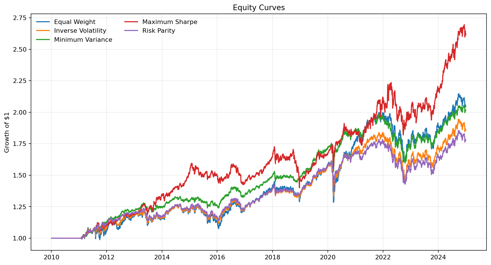

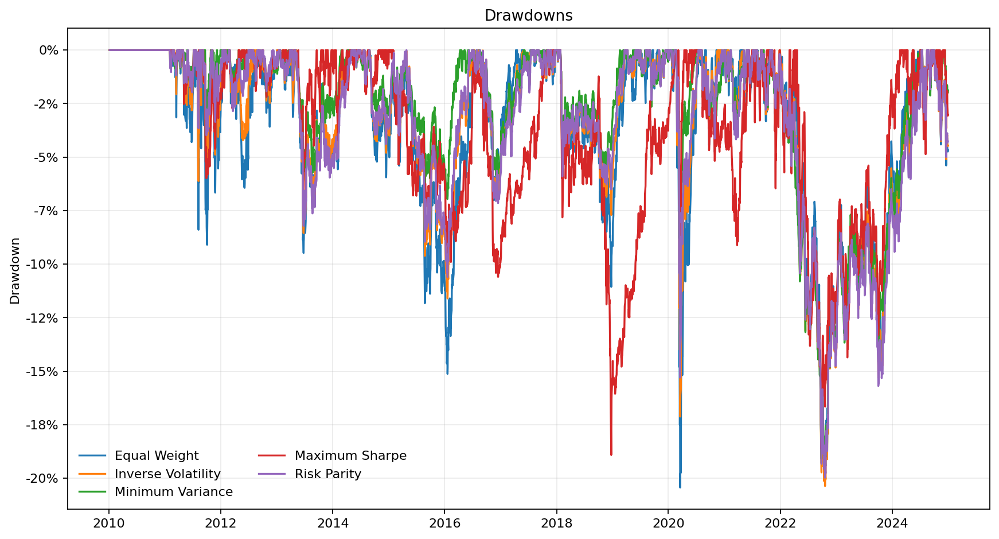

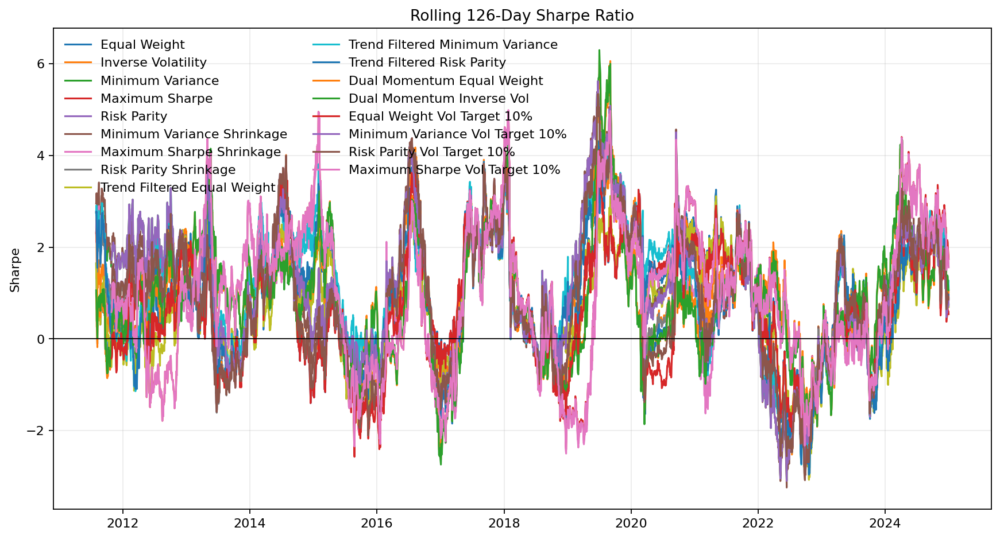

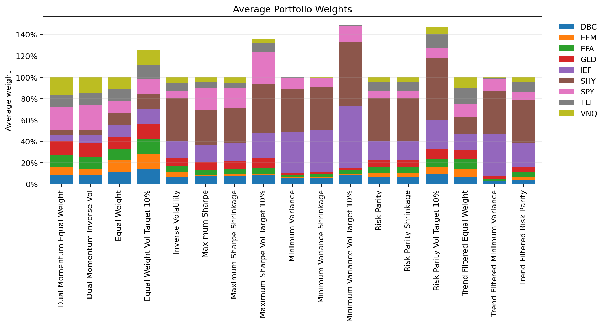

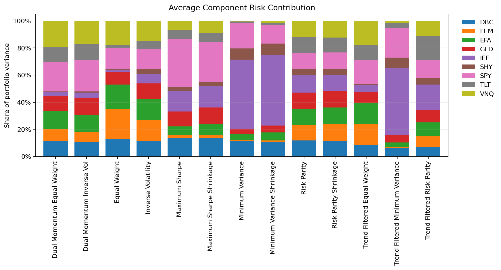

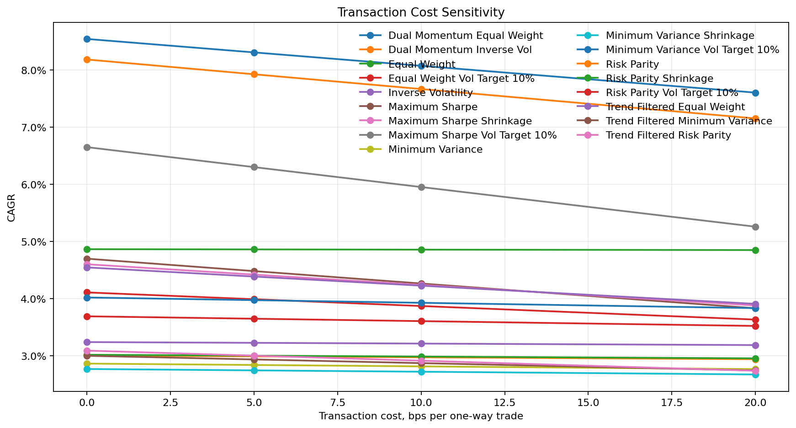

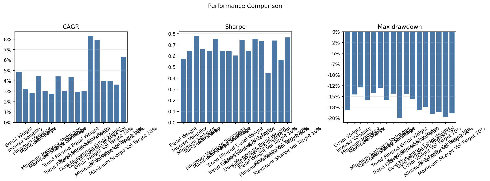

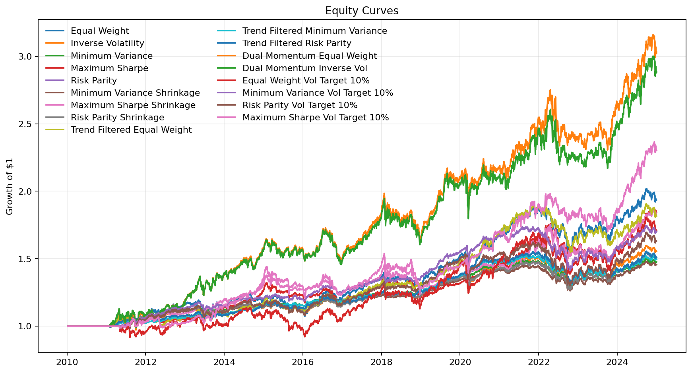

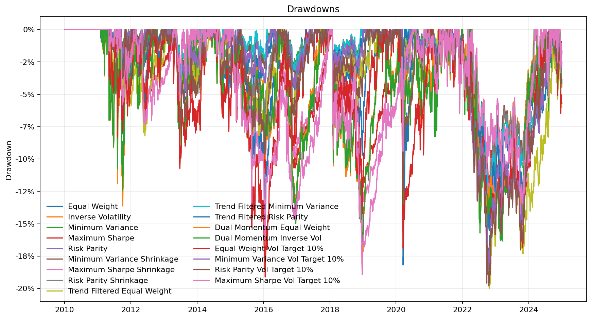

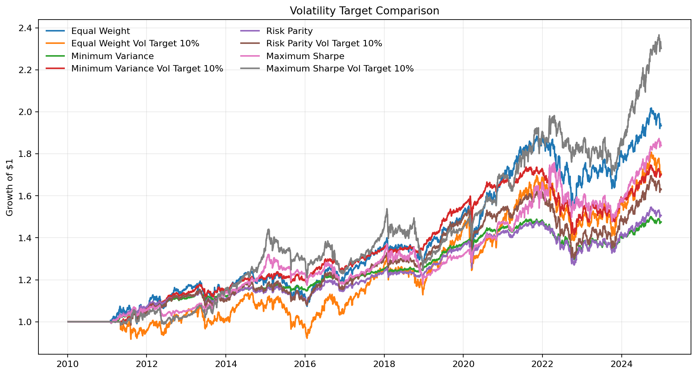

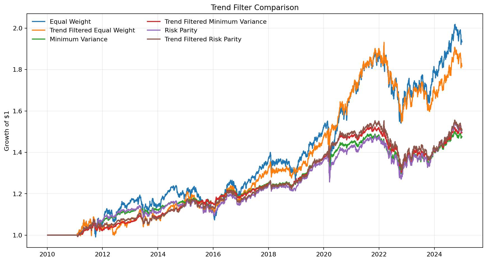

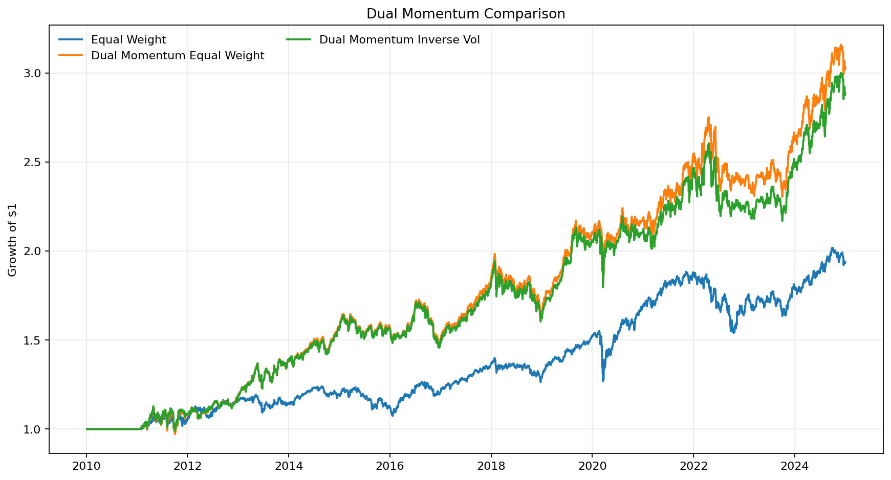

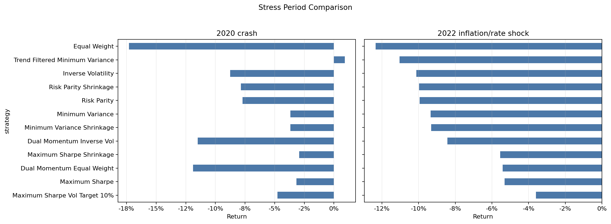

## Limitations

- ETF universe is small and simplified
- ETF choices create survivorship/selection bias
- Results depend on historical ETF returns and may not generalise
- Optimisation methods can be unstable when expected returns/covariances are noisy
- Long-only constraints and max-weight caps simplify implementation
- Transaction costs are simplified and do not include bid-ask spread, taxes, market impact, or borrowing costs
- Past diversification benefits may not hold in future crises
- Trend and dual momentum can overfit historical regimes
- ETF universe selection matters
- SHY inclusion changes defensive allocation assumptions
- Volatility targeting can increase leverage and losses if volatility forecasts lag
- No tax or bid-ask spread model is included

## Future Improvements

- Add Black-Litterman allocation
- Add Ledoit-Wolf covariance shrinkage
- Add Hierarchical Risk Parity
- Add regime-aware allocation
- Add inflation/rate shock stress tests
- Add walk-forward parameter sensitivity
- Add Streamlit dashboard
- Add broader ETF universe and international bonds
