# Systematic Portfolio Construction & Risk Allocation Research Framework

Which portfolio-construction methods remain useful once estimation error, concentration, costs and changing market regimes are taken seriously?

This repository is a research framework, not a strategy promising superior returns. It compares static allocation, risk-management overlays and tactical methods under causal walk-forward estimation, drifted holdings, transaction costs, cash yield, financing costs, stress tests and dependence-aware uncertainty.

Sharpe and Sortino ratios are calculated from returns in excess of the contemporaneous SHY cash proxy; return and drawdown statistics use total net portfolio returns.

## Research Integrity

- The original engine and generated evidence are archived under `archive/baseline_48bcbe9/`.
- Development research is fixed to 2010-2024.
- The 2025+ protocol is frozen separately before confirmation and identified by SHA-256 `pending`.
- Weak and negative experiments remain in `reports/experiment_log.md` and `outputs/parameter_sensitivity.csv`.
- No method is selected solely on CAGR or Sharpe.

## Original Baseline

| strategy                      | cagr  | sharpe_ratio | max_drawdown |
| ----------------------------- | ----- | ------------ | ------------ |
| Equal Weight                  | 4.86% | 0.57         | -18.21%      |
| Minimum Variance              | 2.84% | 0.78         | -12.91%      |
| Maximum Sharpe                | 4.36% | 0.64         | -15.89%      |
| Dual Momentum Equal Weight    | 8.31% | 0.75         | -18.17%      |
| Maximum Sharpe Vol Target 10% | 6.11% | 0.75         | -18.93%      |

The original engine forward-filled target weights instead of drifting holdings, measured turnover between abstract targets, assumed zero return on cash, charged no financing spread above 1x, and used a zero cash hurdle for Sharpe. The archive preserves those outputs; they are not targets for the upgraded framework.

## Development Evidence

The common post-warm-up evaluation begins 2011-05-02.

| strategy                      | cagr  | sharpe_ratio | annualized_volatility | max_drawdown | average_monthly_turnover | effective_assets_by_weight |
| ----------------------------- | ----- | ------------ | --------------------- | ------------ | ------------------------ | -------------------------- |
| Equal Weight                  | 4.17% | 0.39         | 8.85%                 | -18.54%      | 3.10%                    | 8.99                       |
| Traditional 60/40             | 8.93% | 0.82         | 9.79%                 | -21.29%      | 2.26%                    | 1.92                       |
| Inverse Volatility            | 2.83% | 0.40         | 5.08%                 | -14.74%      | 3.01%                    | 4.65                       |
| Minimum Variance              | 2.66% | 0.55         | 3.66%                 | -13.10%      | 4.60%                    | 3.00                       |
| Minimum Variance Shrinkage    | 2.55% | 0.51         | 3.69%                 | -13.14%      | 4.50%                    | 3.07                       |
| Risk Parity                   | 2.65% | 0.39         | 4.71%                 | -14.48%      | 3.37%                    | 4.50                       |
| Risk Parity Shrinkage         | 2.66% | 0.39         | 4.74%                 | -14.53%      | 3.26%                    | 4.52                       |
| Hierarchical Risk Parity      | 2.02% | 0.28         | 4.38%                 | -15.27%      | 6.25%                    | 3.71                       |
| Maximum Sharpe                | 4.84% | 0.52         | 7.90%                 | -18.94%      | 39.55%                   | 3.27                       |
| Maximum Sharpe Shrinkage      | 4.91% | 0.52         | 8.04%                 | -18.54%      | 34.92%                   | 3.48                       |
| Dual Momentum Equal Weight    | 6.67% | 0.54         | 11.31%                | -18.71%      | 34.33%                   | 2.93                       |
| Maximum Sharpe Vol Target 10% | 5.62% | 0.53         | 9.25%                 | -20.63%      | 65.10%                   | 3.27                       |

The table is generated from `outputs/development_performance.csv`. Differences are interpreted alongside walk-forward segments, turnover, concentration, estimator stability, risk contribution and moving-block-bootstrap intervals. A simple method can be more credible than a historically superior optimiser.

## Key Findings

- **Simple benchmark:** Traditional 60/40 led both development Sharpe (0.82) and CAGR (8.93%). The Sharpe-leading portfolio had a -21.29% maximum drawdown, so this is evidence, not a universal allocation recommendation.
- **Risk reduction:** Minimum Variance reduced annualised volatility from 8.85% to 3.66%, but its CAGR fell from 4.17% to 2.66%.
- **Drawdown trade-off:** Trend Filtered Risk Parity had the shallowest maximum drawdown (-7.44%) but only 2.29% CAGR. Trend filtering behaved as insurance rather than free alpha.
- **Shrinkage and HRP:** 25% diagonal shrinkage changed Maximum Sharpe CAGR from 4.84% to 4.91% and monthly turnover from 39.55% to 34.92%. HRP did not improve the development Sharpe over Equal Weight.
- **Volatility targeting:** the 10% Maximum Sharpe overlay changed Sharpe from 0.52 to 0.53, while drawdown moved from -18.94% to -20.63% and turnover rose to 65.10%. Financing and leverage turnover erase any claim of mechanically improved risk.
- **Tactical overlay:** Dual Momentum Equal Weight raised development CAGR to 6.67%, but monthly turnover was 34.33% and its bootstrap Sharpe advantage was not decisive.
- **Risk allocation:** capped Risk Parity averaged 8.59 effective risk contributors versus 4.50 effective assets by weight. Exact equality is sometimes infeasible when the 40% cap binds.
- **Estimator instability:** Maximum Sharpe solved successfully on 98.21% of monthly decisions but averaged 39.55% monthly turnover and regularly hit bounds; it remains a diagnostic method, not the selected representative.
- **Uncertainty:** only Traditional 60/40 had a 95% moving-block-bootstrap Sharpe-difference interval excluding zero versus Equal Weight. These intervals remain conditional on one historical ETF sample.

## Fresh Confirmation

Confirmation remains sealed until the frozen protocol is committed.

## Methods

Static risk allocation:

- Equal Weight and a fixed SPY/IEF 60/40 benchmark
- Inverse Volatility
- Minimum Variance and diagonal-covariance-shrinkage Minimum Variance
- Maximum Sharpe and shrinkage Maximum Sharpe, retained with explicit stability diagnostics
- Risk Parity / Equal Risk Contribution and its shrinkage variant
- Hierarchical Risk Parity

Risk-management overlays:

- 8%, 10% and 12% volatility targets with a 63-day trailing estimator and 1.5x cap
- Positive cash earns SHY; negative cash pays SHY plus a 50 bps annual financing spread

Tactical methods, reported separately:

- Trend-filtered Equal Weight, Minimum Variance and Risk Parity
- Dual Momentum Equal Weight and Inverse Volatility

## Economic Simulation

Targets formed at close t first earn return t+1. Holdings drift between rebalances. Turnover is measured from drifted pre-trade holdings to the new target, and 5 bps one-way costs are charged on actual ETF trades. The same simulator is used for methods and benchmarks.

Headline comparisons begin only when every reported method has completed its warm-up. Parameter-sensitivity families use a common evaluation start within each family.

## Universe

| ETF | Role |
|---|---|
| SPY | US equities |
| EFA | Developed ex-US equities |
| EEM | Emerging markets equities |
| TLT | Long-term US Treasuries |
| IEF | Intermediate US Treasuries |
| SHY | Short-duration US Treasuries and public cash proxy |
| GLD | Gold |
| VNQ | REITs |
| DBC | Commodities |

## Reproduce

```bash
pip install -r requirements.txt
python main.py
python -m pytest -q
```

`main.py` is development-only and cannot request 2025+ data. After the protocol artifact is frozen and hash-verified, `python confirmation.py` runs the fixed confirmation workflow.

## Reports

- [Baseline reproduction](reports/baseline_report.md)
- [Research design and audit](reports/research_design.md)
- [Development results](reports/development_results.md)
- [Confirmation results](reports/confirmation_results.md)
- [Experiment log](reports/experiment_log.md)
- [Limitations](reports/limitations.md)

## Figures

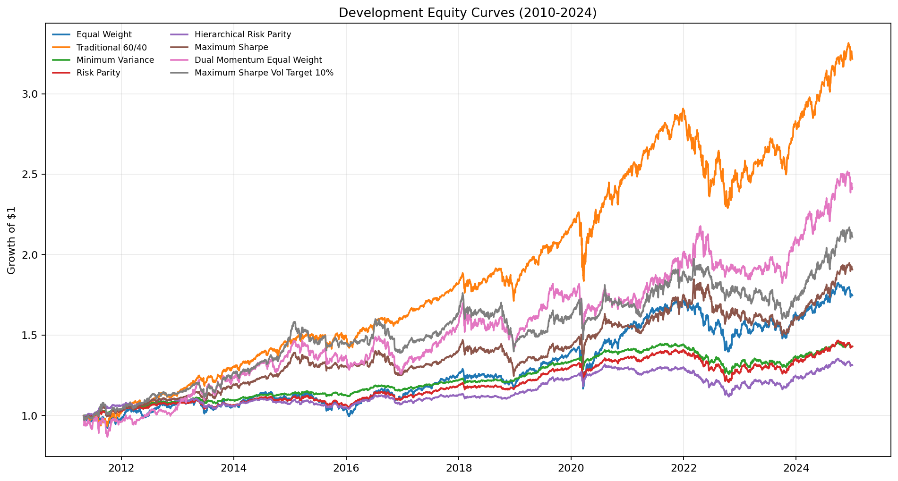

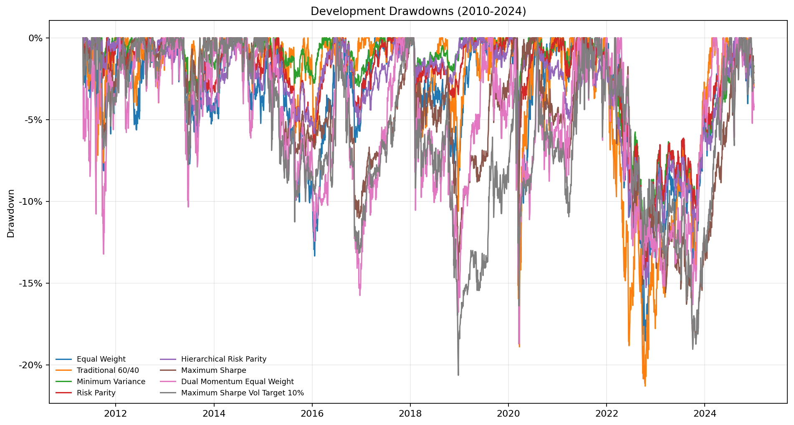

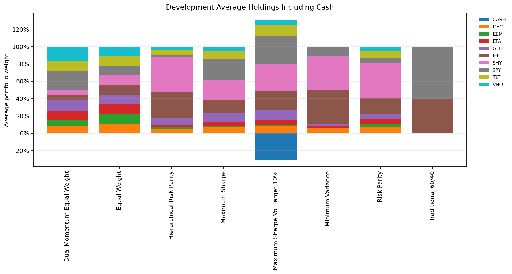

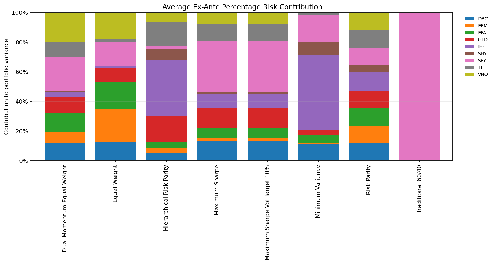

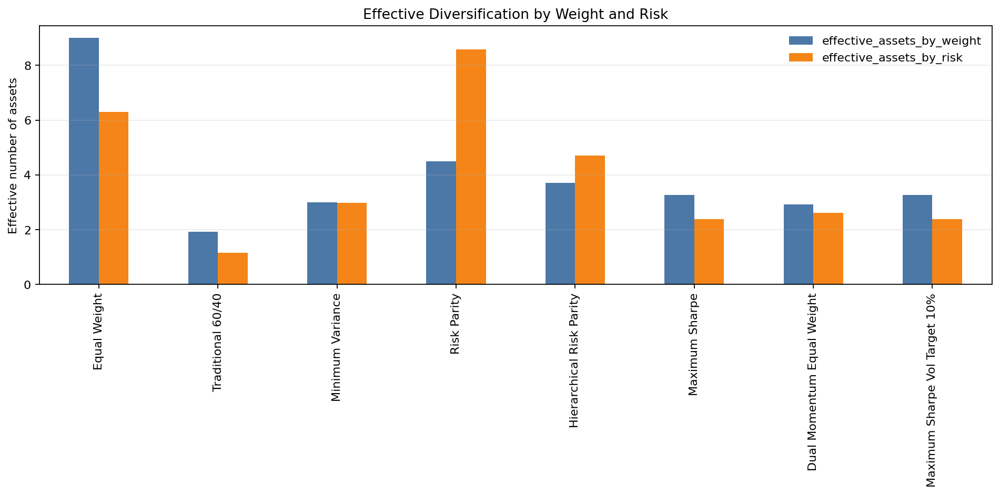

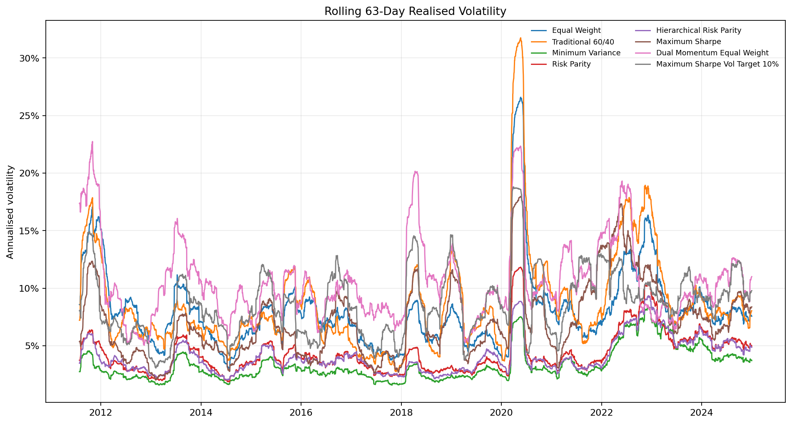

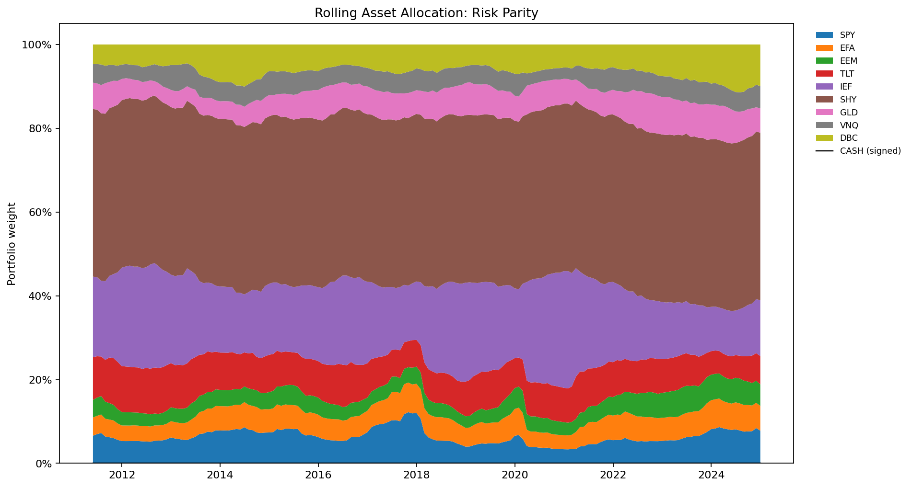

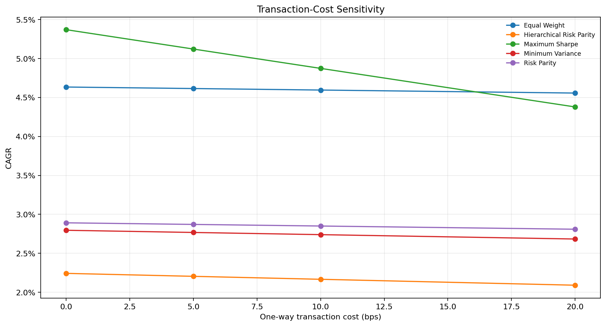

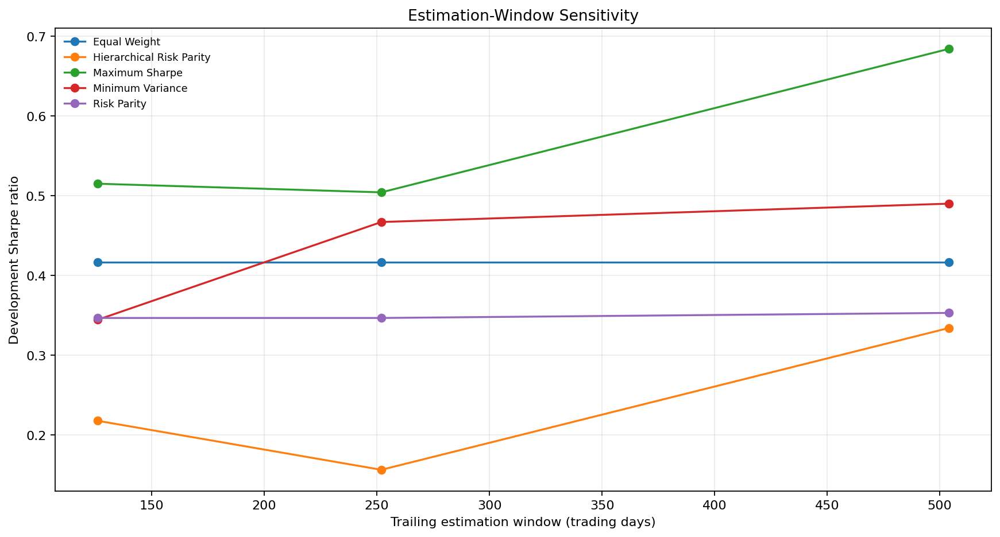

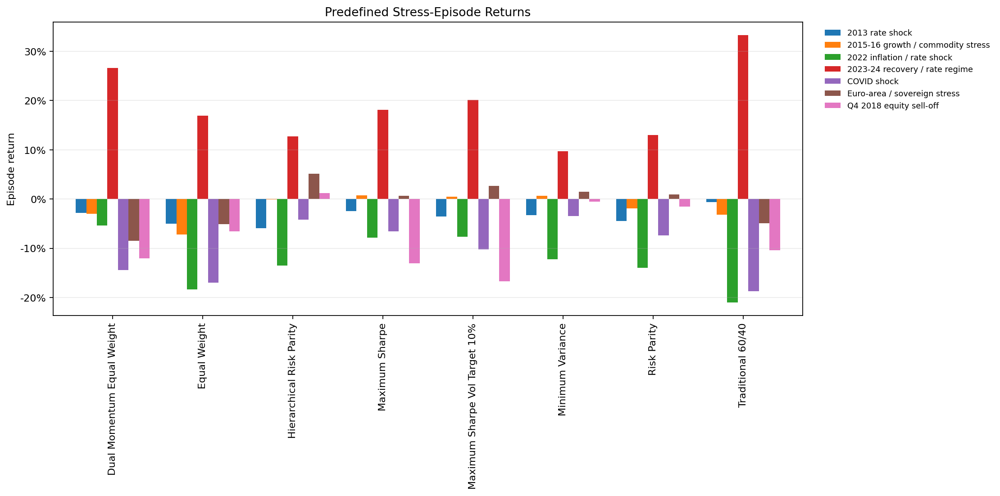

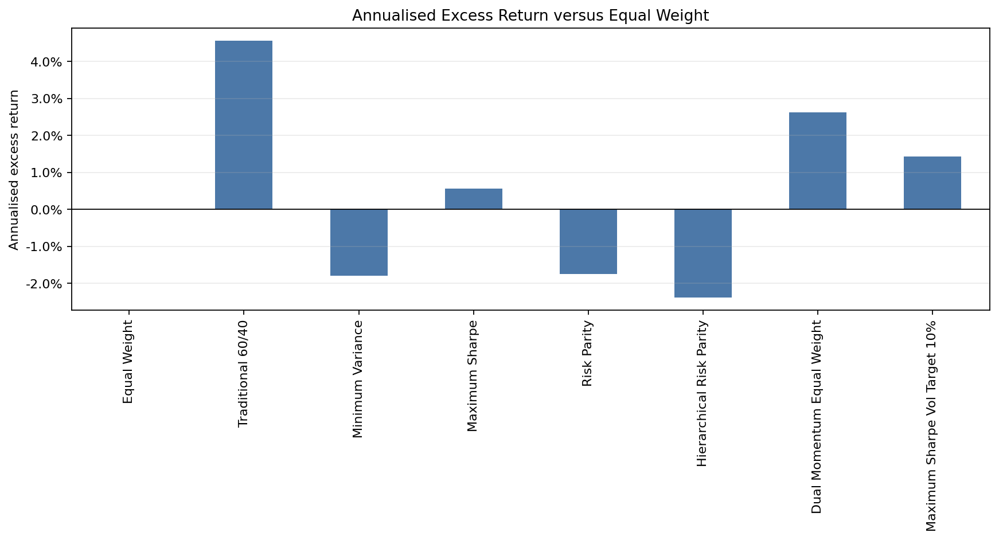

## Limitations

ETF selection matters; the universe is small and survivorship-biased. SHY is a simplified cash proxy. Financing and transaction costs are stylised. Optimised weights depend on noisy estimates. Tactical signals and volatility forecasts are regime dependent. Bootstrap intervals and a short confirmation period do not eliminate uncertainty. See `reports/limitations.md` for the full discussion.
